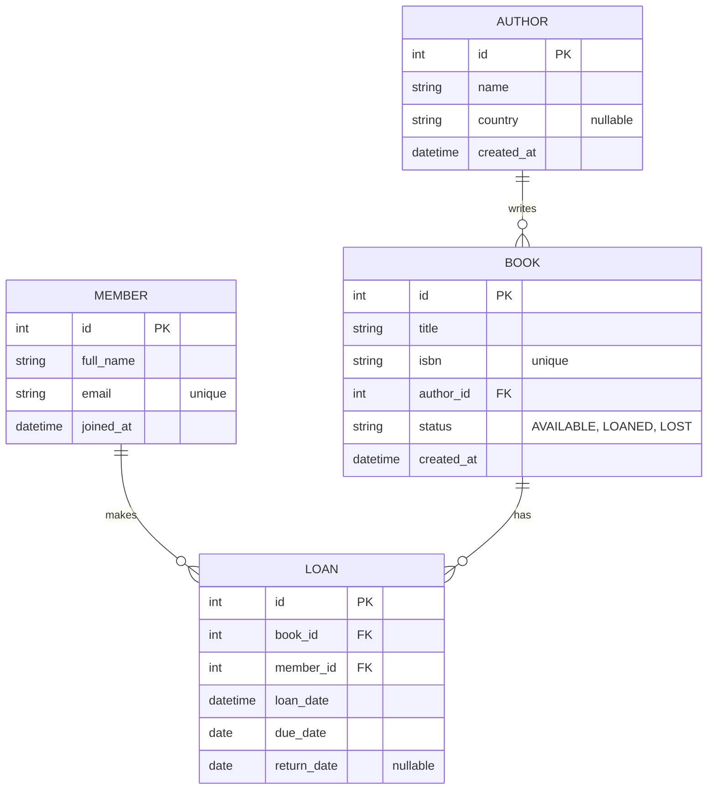
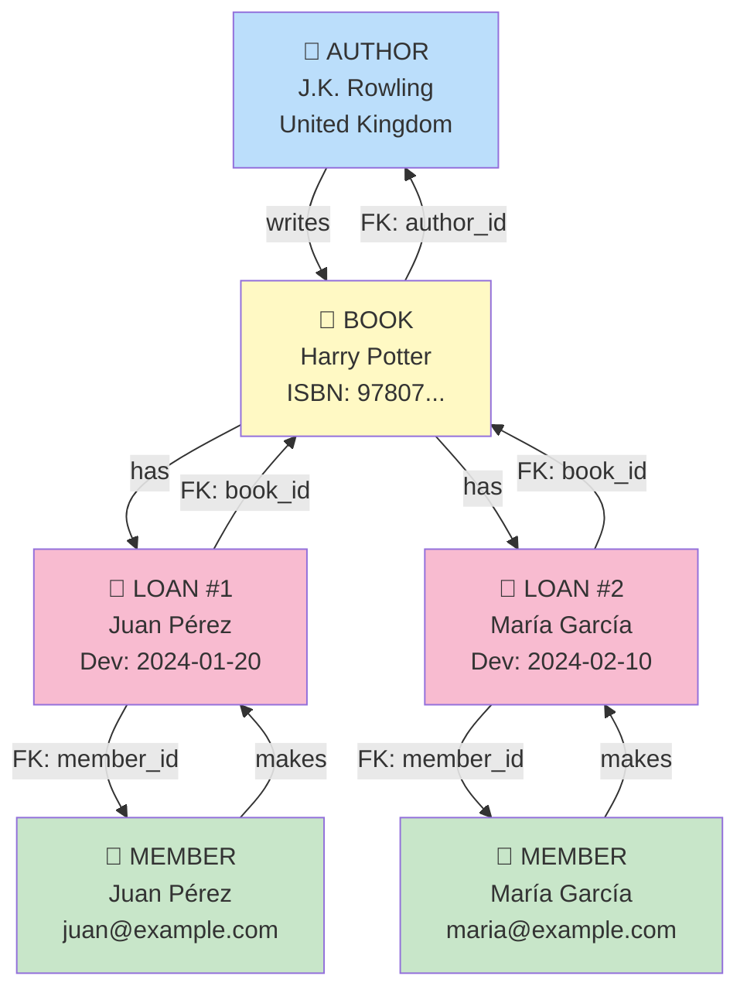

# 📊 Diagrama ER - Django Library

Modelo entidad-relación completo del proyecto

---

## 🎯 Diagrama ER (Entity-Relationship)



---

## 📋 Explicación del Diagrama

### **Entidades (Tablas)**

#### 1️⃣ **AUTHOR** (Autor)
```
┌─────────────────────────┐
│ AUTHOR                  │
├─────────────────────────┤
│ id (PK)                 │
│ name (VARCHAR 200)      │
│ country (VARCHAR 100)   │ ← nullable
│ created_at (DATETIME)   │
└─────────────────────────┘
```

**Propósito:** Almacenar información de autores
- `id`: Identificador único (auto-incrementado)
- `name`: Nombre del autor (obligatorio)
- `country`: País de origen (opcional)
- `created_at`: Fecha de registro (automático)

---

#### 2️⃣ **BOOK** (Libro)
```
┌─────────────────────────────────────┐
│ BOOK                                │
├─────────────────────────────────────┤
│ id (PK)                             │
│ title (VARCHAR 300)                 │
│ isbn (VARCHAR 20, UNIQUE)           │
│ author_id (FK → AUTHOR)             │
│ status (VARCHAR 20, CHOICES)        │
│ created_at (DATETIME)               │
└─────────────────────────────────────┘
```

**Propósito:** Almacenar información de libros
- `id`: Identificador único
- `title`: Título del libro
- `isbn`: Código ISBN único (no puede repetirse)
- `author_id`: Referencia al autor (Foreign Key)
- `status`: Estado del libro (AVAILABLE, LOANED, LOST)
- `created_at`: Fecha de registro

---

#### 3️⃣ **MEMBER** (Miembro)
```
┌──────────────────────────────┐
│ MEMBER                       │
├──────────────────────────────┤
│ id (PK)                      │
│ full_name (VARCHAR 200)      │
│ email (VARCHAR 254, UNIQUE)  │
│ joined_at (DATETIME)         │
└──────────────────────────────┘
```

**Propósito:** Almacenar información de miembros de la biblioteca
- `id`: Identificador único
- `full_name`: Nombre completo del miembro
- `email`: Email único (no puede repetirse)
- `joined_at`: Fecha de inscripción (automática)

---

#### 4️⃣ **LOAN** (Préstamo)
```
┌────────────────────────────────────┐
│ LOAN                               │
├────────────────────────────────────┤
│ id (PK)                            │
│ book_id (FK → BOOK)                │
│ member_id (FK → MEMBER)            │
│ loan_date (DATETIME)               │
│ due_date (DATE)                    │
│ return_date (DATE)                 │ ← nullable
└────────────────────────────────────┘
```

**Propósito:** Registrar préstamos de libros
- `id`: Identificador único del préstamo
- `book_id`: Referencia al libro (Foreign Key)
- `member_id`: Referencia al miembro (Foreign Key)
- `loan_date`: Fecha/hora del préstamo (automática)
- `due_date`: Fecha esperada de devolución
- `return_date`: Fecha real de devolución (NULL si no se devolvió)

---

## 🔗 Relaciones (Cardinalidad)

### **1. AUTHOR → BOOK (1:N - Uno a Muchos)**

```
Un autor PUEDE escribir MUCHOS libros
Un libro DEBE tener UN SOLO autor

┌────────┐        ┌──────┐
│ AUTHOR │────┬───│ BOOK │
└────────┘    │   └──────┘
         1:N  │
        (writes)
```

**Restricción:** `on_delete=PROTECT`
- No puedes eliminar un autor si tiene libros registrados
- Protege la integridad referencial

**Ejemplo:**
```
Author: J.K. Rowling
├── Book: Harry Potter 1
├── Book: Harry Potter 2
└── Book: Harry Potter 3
```

---

### **2. MEMBER → LOAN (1:N - Uno a Muchos)**

```
Un miembro PUEDE hacer MUCHOS préstamos
Un préstamo DEBE pertenecer a UN SOLO miembro

┌────────┐        ┌──────┐
│ MEMBER │────┬───│ LOAN │
└────────┘    │   └──────┘
         1:N  │
        (makes)
```

**Restricción:** `on_delete=CASCADE`
- Si eliminas un miembro, se eliminan automáticamente todos sus préstamos
- Evita préstamos huérfanos

**Ejemplo:**
```
Member: Juan Pérez
├── Loan: Harry Potter (activo)
├── Loan: The Shining (devuelto)
└── Loan: Murder on Orient Express (activo)
```

---

### **3. BOOK → LOAN (1:N - Uno a Muchos)**

```
Un libro PUEDE ser prestado MUCHAS VECES
Un préstamo DEBE referir a UN SOLO libro

┌──────┐         ┌──────┐
│ BOOK │────┬────│ LOAN │
└──────┘    │    └──────┘
        1:N │
      (has)
```

**Restricción:** `on_delete=PROTECT`
- No puedes eliminar un libro si tiene préstamos registrados
- Protege el historial de préstamos

**Ejemplo:**
```
Book: Harry Potter
├── Loan: Juan Pérez (dev)
├── Loan: María García (activo)
└── Loan: Carlos López (dev)
```

---

## 🔄 Flujo de Relaciones Completo



---

## 📊 Tabla Comparativa

| Aspecto | Descripción |
|---------|-------------|
| **Entidades** | 4 tablas (Author, Book, Member, Loan) |
| **Relaciones** | 3 relaciones 1:N |
| **Foreign Keys** | 3 (Book.author_id, Loan.book_id, Loan.member_id) |
| **Campos UNIQUE** | 2 (Book.isbn, Member.email) |
| **Campos NULL** | 2 (Author.country, Loan.return_date) |
| **Total de Campos** | 16 |

---

## 🔐 Restricciones de Integridad

| Tabla | Campo | Restricción | Efecto |
|-------|-------|-------------|--------|
| Book | author_id | FK PROTECT | No eliminar autor con libros |
| Loan | book_id | FK PROTECT | No eliminar libro con préstamos |
| Loan | member_id | FK CASCADE | Eliminar miembro → elimina préstamos |
| Book | isbn | UNIQUE | No permite ISBNs duplicados |
| Member | email | UNIQUE | No permite emails duplicados |

---

## 💾 Mapeo a Base de Datos SQLite

```sql
-- AUTHOR table
CREATE TABLE library_author (
    id INTEGER PRIMARY KEY AUTOINCREMENT,
    name VARCHAR(200) NOT NULL,
    country VARCHAR(100),
    created_at DATETIME DEFAULT CURRENT_TIMESTAMP
);

-- BOOK table
CREATE TABLE library_book (
    id INTEGER PRIMARY KEY AUTOINCREMENT,
    title VARCHAR(300) NOT NULL,
    isbn VARCHAR(20) UNIQUE NOT NULL,
    author_id INTEGER NOT NULL REFERENCES library_author(id) ON DELETE PROTECT,
    status VARCHAR(20) DEFAULT 'AVAILABLE',
    created_at DATETIME DEFAULT CURRENT_TIMESTAMP
);

-- MEMBER table
CREATE TABLE library_member (
    id INTEGER PRIMARY KEY AUTOINCREMENT,
    full_name VARCHAR(200) NOT NULL,
    email VARCHAR(254) UNIQUE NOT NULL,
    joined_at DATETIME DEFAULT CURRENT_TIMESTAMP
);

-- LOAN table
CREATE TABLE library_loan (
    id INTEGER PRIMARY KEY AUTOINCREMENT,
    book_id INTEGER NOT NULL REFERENCES library_book(id) ON DELETE PROTECT,
    member_id INTEGER NOT NULL REFERENCES library_member(id) ON DELETE CASCADE,
    loan_date DATETIME DEFAULT CURRENT_TIMESTAMP,
    due_date DATE NOT NULL,
    return_date DATE
);
```

---

## 🎯 Ejemplo de Datos

```
📚 AUTHOR
├── (1) "J.K. Rowling", "United Kingdom"
├── (2) "Stephen King", "United States"
└── (3) "Agatha Christie", "United Kingdom"

📖 BOOK
├── (1) "Harry Potter", "9780747532699", author_id=1, AVAILABLE
├── (2) "The Shining", "9780385333312", author_id=2, LOANED
└── (3) "Murder on Orient Express", "9780062693556", author_id=3, AVAILABLE

👥 MEMBER
├── (1) "Juan Pérez", "juan@example.com"
└── (2) "María García", "maria@example.com"

📅 LOAN
├── (1) book_id=2, member_id=1, loan_date=2024-01-15, due_date=2024-01-29, return_date=NULL
└── (2) book_id=3, member_id=2, loan_date=2024-01-10, due_date=2024-01-24, return_date=2024-01-23
```

---

## ✅ Verificación del Modelo

Usa esta checklist para verificar que tu BD coincide:

- [ ] **library_author**: id, name, country (nullable), created_at
- [ ] **library_book**: id, title, isbn (unique), author_id (FK), status, created_at
- [ ] **library_member**: id, full_name, email (unique), joined_at
- [ ] **library_loan**: id, book_id (FK), member_id (FK), loan_date, due_date, return_date (nullable)
- [ ] **Relación 1:N** entre Author y Book (1 autor, muchos libros)
- [ ] **Relación 1:N** entre Member y Loan (1 miembro, muchos préstamos)
- [ ] **Relación 1:N** entre Book y Loan (1 libro, muchos préstamos)
- [ ] **on_delete=PROTECT** en author_id y book_id
- [ ] **on_delete=CASCADE** en member_id
