# 📖 Guía de Uso - Django Library Admin

Cómo usar la aplicación una vez recreada en el panel administrativo

---

## 🎯 Flujo General de Uso

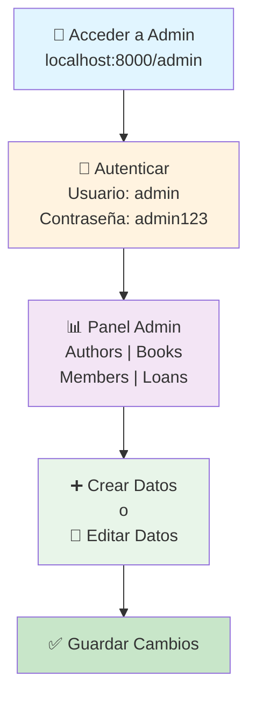

---

## 📚 Paso 1: Crear un Autor

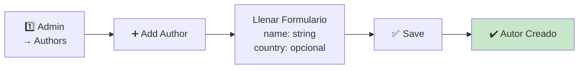

**Datos a ingresar:**
- **Name:** Nombre del autor (ej: "J.K. Rowling")
- **Country:** País opcional (ej: "United Kingdom")

---

## 📖 Paso 2: Crear un Libro

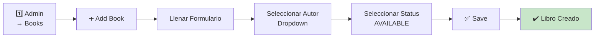

**Datos a ingresar:**
- **Title:** Título del libro (ej: "Harry Potter")
- **ISBN:** Código único (ej: "9780747532699")
- **Author:** Seleccionar autor del dropdown
- **Status:** Seleccionar uno de:
  - `AVAILABLE` = Disponible para préstamo
  - `LOANED` = Actualmente prestado
  - `LOST` = Perdido

---

## 👥 Paso 3: Registrar un Miembro

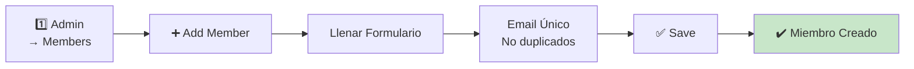

**Datos a ingresar:**
- **Full Name:** Nombre completo (ej: "Juan Pérez")
- **Email:** Email único (ej: "juan@example.com")

---

## 📅 Paso 4: Crear un Préstamo

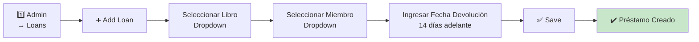

**Datos a ingresar:**
- **Book:** Seleccionar libro disponible
- **Member:** Seleccionar miembro
- **Due Date:** Fecha de devolución esperada
- **Return Date:** Se rellena automáticamente cuando se devuelve

---

## 🔄 Ciclo de Vida de un Préstamo

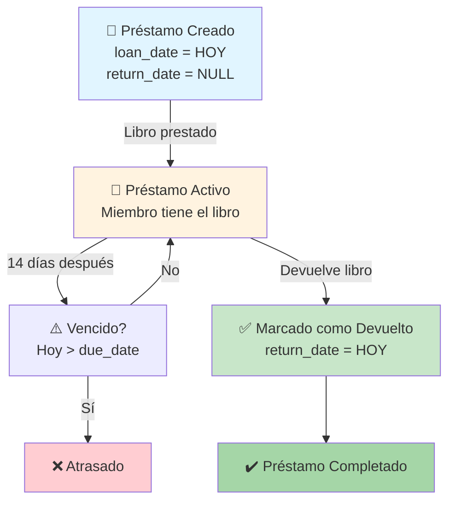

---

## 📊 Estados de un Libro

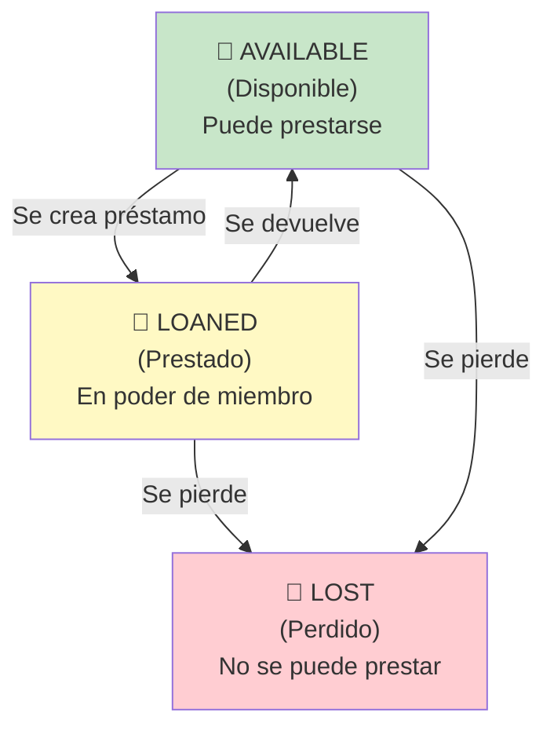

---

## 🔍 Búsqueda y Filtrado

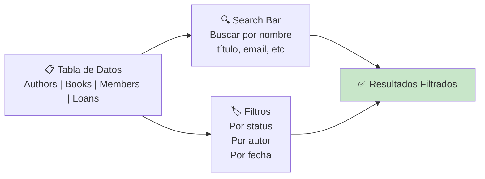

**Ejemplos de búsqueda:**
- **Authors:** Buscar por nombre
- **Books:** Buscar por título o ISBN
- **Members:** Buscar por nombre o email
- **Loans:** Filtrar por fecha de préstamo

---

## ✏️ Editar Datos

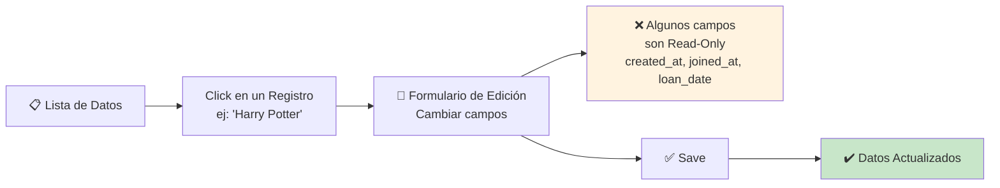

**Campos Read-Only (No se pueden editar):**
- `created_at` (Autor, Libro)
- `joined_at` (Miembro)
- `loan_date` (Préstamo)

---

## 🗑️ Eliminar Datos

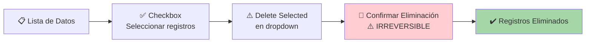

**⚠️ Restricciones:**
- **No puedes eliminar un Author** si tiene libros (`on_delete=PROTECT`)
- **Si eliminas un Member**, se eliminan automáticamente sus préstamos (`on_delete=CASCADE`)
- **No puedes eliminar un Book** si tiene préstamos activos

---

## 🎯 Caso de Uso: Préstamo de Libro

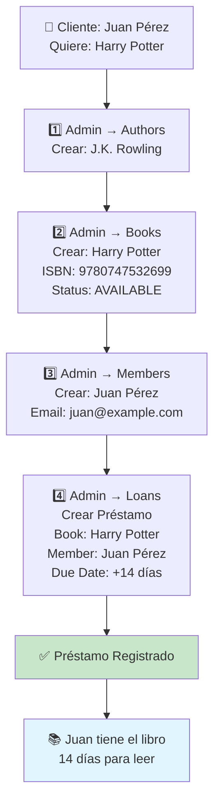

---

## 📖 Caso de Uso: Devolución de Libro

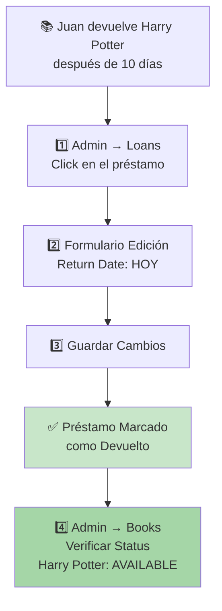

---

## 🔎 Caso de Uso: Encontrar Libros Disponibles

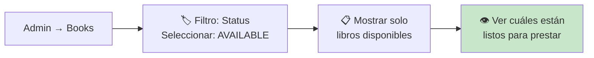

---

## 📊 Vista Rápida de Datos

| Sección | Qué ver | Acciones |
|---------|---------|----------|
| **Authors** | Lista de autores | ➕ Agregar, ✏️ Editar, 🗑️ Eliminar |
| **Books** | Todos los libros + estado | ➕ Agregar, ✏️ Editar, 🏷️ Filtrar por status |
| **Members** | Miembros registrados | ➕ Agregar, ✏️ Editar, 🗑️ Eliminar |
| **Loans** | Préstamos activos + completados | ➕ Agregar, ✏️ Editar (return_date), 🗑️ Eliminar |

---

## ⚡ Atajos Útiles

| Acción | Dónde |
|--------|-------|
| Ver todos los libros prestados | Books → Filtro: Status=LOANED |
| Ver libros perdidos | Books → Filtro: Status=LOST |
| Ver préstamos sin devolución | Loans → Filtro: Return Date = vacío |
| Buscar libros de un autor | Books → Search: nombre del autor |
| Ver todos los préstamos de un miembro | Loans → Search: nombre del miembro |

---

## 🎓 Ejercicio Práctico

**Objetivo:** Crear un sistema de préstamo funcional

1. ✅ Crear 3 autores diferentes
2. ✅ Crear 5 libros (variado de autores)
3. ✅ Registrar 3 miembros
4. ✅ Crear 4 préstamos (dejar 1 libro sin préstamo)
5. ✅ Marcar 1 préstamo como devuelto
6. ✅ Filtrar libros disponibles
7. ✅ Buscar préstamos de un miembro específico

---

## ✅ ¡Listo!

Ya sabes cómo usar el panel administrativo de Django Library. La aplicación es funcional para:
- 📚 Gestionar catálogo de libros
- 👥 Administrar miembros
- 📅 Registrar préstamos
- 🔍 Buscar y filtrar datos
